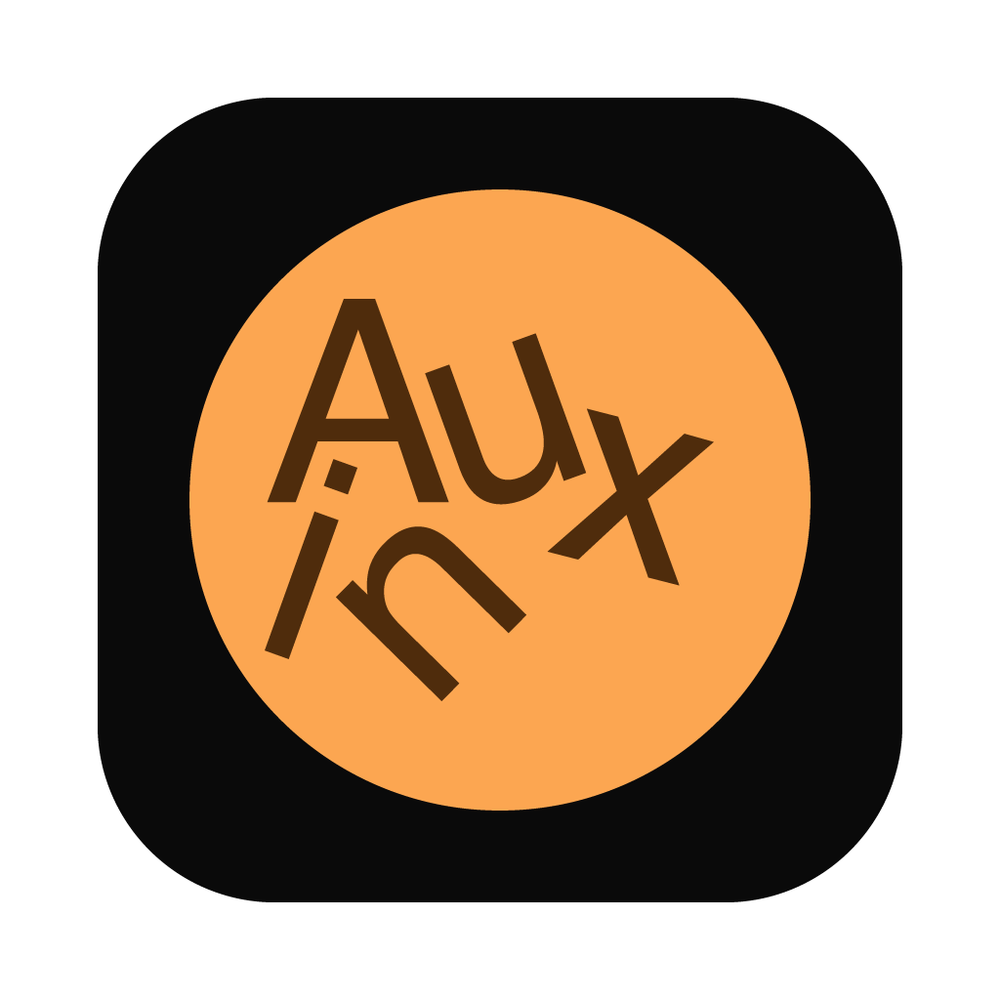
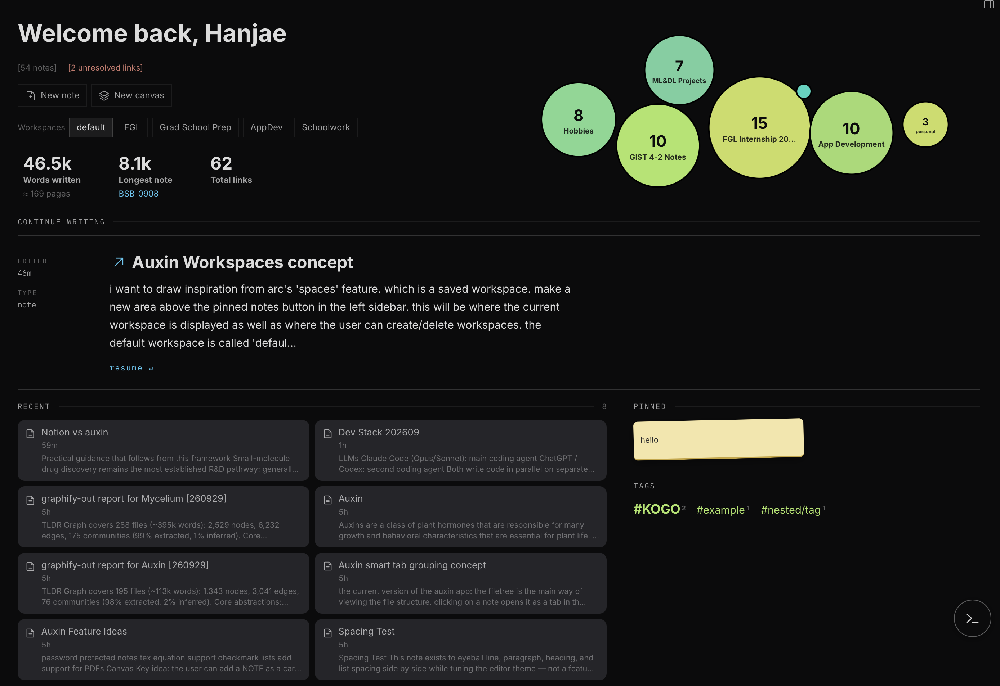
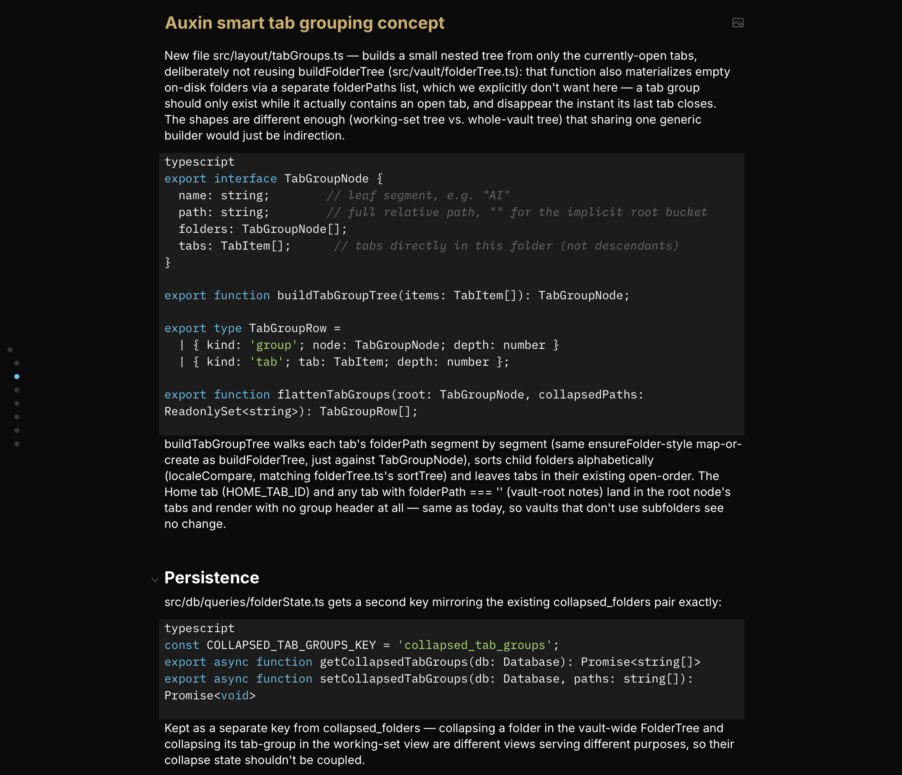
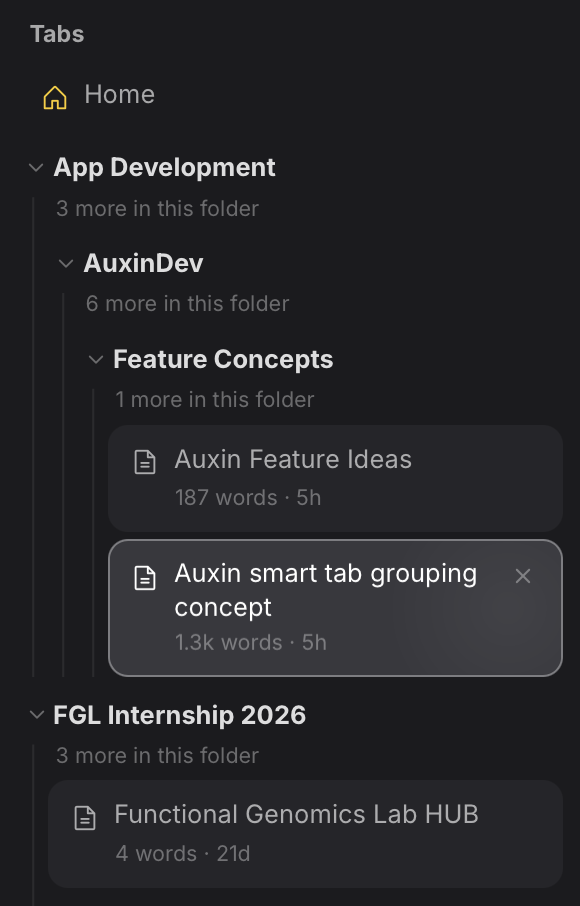
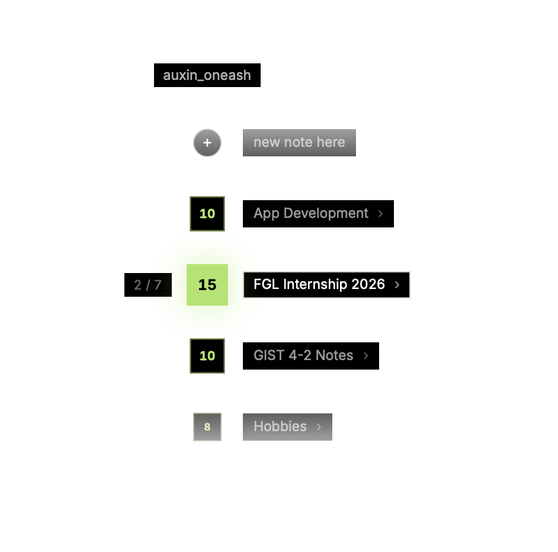
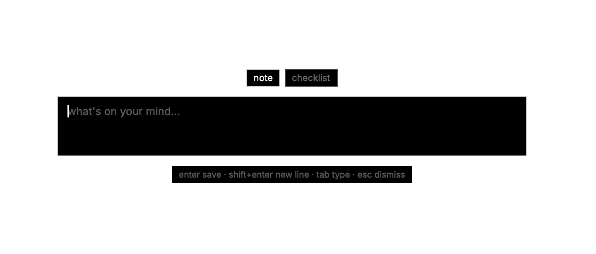

# Auxin

A markdown note-taking app for a local vault of plain-text files. Built with Tauri, React, and SQLite.

## Features

- **Plain-text vault** — notes are markdown files on disk, organized in regular folders. Nothing is locked into a database; you can edit the files with any other tool.
- **Editor** — CodeMirror-based markdown editor with syntax highlighting for embedded code blocks (JS, Python, Rust, CSS, JSON), TeX math via KaTeX, tables, and a table-of-contents sidebar.
- **Wiki-style links and tags** — `[[links]]` between notes, a backlinks panel, an unresolved-links panel, and a tag browser.
- **Hub notes** — a note can be marked as a hub for a folder, aggregating and linking out to everything inside it.
- **Canvas boards** — freeform, pannable/zoomable boards for arranging note cards and drawing connections between them, PureRef-style. Still a work in progress.
- **Graph view** — 2D and 3D visualizations of how notes link to each other. Still a work in progress.
- **Quick file search** — a Spotlight/Raycast-style floating popup (global shortcut) for jumping to any note without leaving the keyboard.
- **Sticky capture** — a small always-on-top capture window (global shortcut) for jotting something down without switching to the main window, saved onto a sticky board.
- **Tabs and workspaces** — grouped tabs with drag/close/pan animations, and per-vault workspaces that remember which tabs were open.
- **Integrated terminal** — an xterm.js panel backed by a real PTY, for running commands without leaving the app.
- **Home dashboard** — word counts, recent/pinned notes, a tag cloud, and a folder-size overview for the vault.

## Screenshots

**Editor** — markdown alongside code blocks and inline TeX.

**Tabs and workspaces** — tabs grouped by folder, collapsible per group.

**Quick file search** — a floating popup for jumping to any note.

**Sticky capture** — a small always-on-top window for quick notes.

Canvas boards and the graph view are still being finished — screenshots to come once they're ready.

## Architecture

Auxin is a Tauri 2 app: a Rust backend handles the OS-level work, and a React 19 + TypeScript frontend (built with Vite) handles the UI.

**Source of truth is the filesystem.** A vault is just a folder of markdown files. Auxin doesn't own your notes — it reads and writes them directly, and a note is still a perfectly normal file if you open it elsewhere.

**Local SQLite index.** For fast search, backlinks, tags, and the graph view, Auxin maintains a SQLite database at `<vault>/.auxin/index.sqlite`. This index is a cache, not a source of truth — it's rebuilt/kept in sync with the vault by a filesystem watcher and sync engine, and can be safely deleted and regenerated.

**Rust backend (`src-tauri/`)** exposes commands for filesystem operations, vault scanning, app config persistence, terminal sessions (via `portable-pty`), and the always-on-top popup windows (file searcher, sticky capture) — the latter implemented as native NSPanels on macOS so they can receive keystrokes without stealing focus from other apps.

**Frontend stack:**
- CodeMirror 6 for the editor
- Zustand for state (vault, panel layout, sticky notes, table of contents)
- Tailwind CSS with a small custom design-token layer
- `react-three-fiber` / `three` / `d3-force` for the graph views
- `@tauri-apps/plugin-sql` for the SQLite index

## Recommended IDE Setup

- [VS Code](https://code.visualstudio.com/) + [Tauri](https://marketplace.visualstudio.com/items?itemName=tauri-apps.tauri-vscode) + [rust-analyzer](https://marketplace.visualstudio.com/items?itemName=rust-lang.rust-analyzer)
